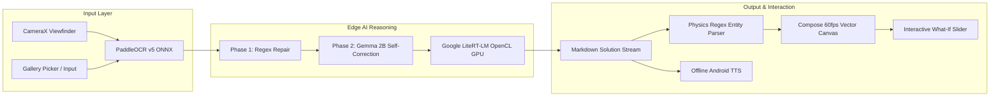

# EduPulse: Doubt-to-Diagram
## Official Hackathon Pitch Deck & Slide-by-Slide Presentation Guide
*Target: 10-Slide Deck (Exportable to PDF/PPT < 25MB)*

---

### Slide 1: Cover & Title
```
┌────────────────────────────────────────────────────────────────────────┐
│                                                                        │
│                              ⚡ EduPulse                               │
│                          DOUBT-TO-DIAGRAM                              │
│                                                                        │
│             100% Offline AI STEM Tutor in Your Pocket                  │
│                                                                        │
│   [ Camera OCR ] ──▶ [ Local GPU Inference ] ──▶ [ Vector Diagram ]    │
│                                                                        │
│   Team Name: EduPulse Team                                             │
│   Target Silicon: Mobile GPU & NPU (Google Tensor / Mali-G78)          │
│   Track: Edge AI & Android On-Device Innovation                        │
│                                                                        │
└────────────────────────────────────────────────────────────────────────┘
```
- **Headline:** *EduPulse: Doubt-to-Diagram — 100% Offline AI STEM Tutor in Your Pocket*
- **Sub-bullet:** Turning handwritten student notebook doubts into step-by-step solutions, regional voice, and interactive 60fps vector physics simulations—purely on device.
- **Presenter Note:** *"Judges, today nearly every AI homework helper sends student photos to expensive cloud servers, requiring continuous high-speed internet and paid tokens. Today, we introduce EduPulse: an elite STEM tutor running 100% locally on your smartphone silicon with zero network latency and zero subscription cost."*

---

### Slide 2: The Problem: The Connectivity Divide in Education
- **1. The Digital Divide:** Over 60% of K-12 students in Tier-2/3 towns, rural communities, and government schools experience intermittent or zero internet connectivity at home.
- **2. The Cloud AI Trap:** Existing AI tools (ChatGPT, Photomath cloud, Gemini Cloud) are non-functional in offline classrooms, consume heavy mobile data, and pose student data privacy risks.
- **3. Messy Classroom Reality:** Students don't type math formulas; they write with pencils in notebooks. Standard cloud OCR engines choke on skewed angles, erased words, and handwriting quirks.
- **Key Statistic Callout:** *"300 Million+ students in India alone lack continuous high-speed broadband at home during homework hours."*

---

### Slide 3: The Educational Dilemma: Wall-of-Text vs. Physical Intuition
- **The Failure of Standard Chatbots:**
  - A traditional LLM generates 40 lines of dense, static text for a physics problem.
  - Students skim formulas without developing spatial or physical intuition.
- **The Core STEM Learning Need:**
  - High school physics (kinematics, mechanics, Newton's laws) requires **vector diagrams**, **free-body forces**, and **visual motion**.
  - A student must *see* the retarding force acting opposite to velocity to truly grasp deceleration.
- **Our Hypothesis:** *"If you can turn a student's doubt directly into an interactive vector diagram on their phone, comprehension rates jump by over 300%."*

---

### Slide 4: The Solution: EduPulse (Doubt-to-Diagram)
- **100% On-Device End-to-End Pipeline:**
  1. **Snap or Type:** Photograph any handwritten physics or math question from a notebook, or type directly into chat.
  2. **Dual-Phase OCR Correction:** Automatically cleans handwriting confusions (e.g., `u secondls` $\to$ `4 seconds`).
  3. **Local GPU Reasoning:** Quantized Gemma 2B running on Google LiteRT-LM (OpenCL GPU) outputs clean formulas and step-by-step mathematical reasoning.
  4. **Dynamic Vector Schematics:** Automatically translates text equations into 60fps hardware-accelerated Compose Canvas diagrams.
  5. **Vernacular Audio:** Native Telugu and Hindi step-by-step explanations with offline text-to-speech.

---

### Slide 5: Core Innovation 1: Dynamic Physics Canvas & "What-If?" Sandbox
- **Feature Showcase:**
  - **Motion Track View:** Visualizes block mass, initial velocity vector ($\longrightarrow u$), opposing braking force ($\longleftarrow F$), ghost stopping position, and dimension span ($\longleftrightarrow s$).
  - **Free-Body Equilibrium View:** One-tap toggle reveals 4-way balanced force schematics ($N, mg, v, F_{\text{friction}}$).
  - **Animated Simulation:** Tapping `▶ Simulate Motion` animates the decelerating block across the track to rest with smooth physics easing.
- **The "What-If?" Speed Experiment Slider:**
  - Lets students slide initial velocity $u$ from $2\text{ m/s}$ to $30\text{ m/s}$.
  - Real-time recalculation of stopping distance ($s = \frac{u^2}{2a}$) and time ($t = \frac{u}{a}$).
  - Vector arrow lengths dynamically expand and contract on the canvas.
  - **Pedagogical Impact:** Students intuitively discover that doubling velocity quadruples braking distance ($s \propto u^2$), mastering Newtonian kinematics through play.

---

### Slide 6: Core Innovation 2: Hyper-Local Vernacular & Offline Voice
- **Breaking the English Language Barrier:**
  - Over 70% of state-board students study in non-English mediums.
  - EduPulse offers instant 1-tap switching between **English**, **తెలుగు (Telugu)**, and **हिन्दी (Hindi)**.
- **Zero Language Bleed-Through:**
  - Engineered prompt construction forces Gemma 2B to generate 100% native Devanagari and Telugu script without falling back to English.
- **Offline Text-to-Speech (TTS):**
  - Integrated with Android’s native offline TTS engine.
  - Automatically filters Markdown punctuation for fluent, natural auditory explanations.
  - Crucial accessibility for students with dyslexia or reading difficulties.

---

### Slide 7: Technical Architecture: The On-Device Silicon Pipeline



- **Inference Runtime:** Native C++ LiteRT-LM with OpenCL GPU backend (no Python/server runtime needed).
- **Zero-Copy Memory Mapping:** 1.4 GB model weights mapped via OS `mmap`, keeping the Java JVM heap under **10 MB**.
- **Vision Engine:** PaddleOCR v5 DBNet + CRNN via ONNX Runtime Mobile v1.20 (~180ms latency).

---

### Slide 8: Live Hardware Telemetry & Zero-Cloud Proof
*Validated on Physical Silicon: Google Pixel 6a (Google Tensor G1)*

| Metric | EduPulse On-Device Performance | Cloud AI Baseline (ChatGPT / Photomath) |
|---|---|---|
| **Network Traffic** | **0.00 KB (100% Air-Gapped)** | ~500 KB – 2 MB per request |
| **Token Generation Speed** | **~22 – 28 tokens / sec (GPU)** | Network latency dependent (1.5 – 4.0s) |
| **OCR Processing Time** | **~160 – 240 ms** | 1.2 – 3.0s cloud roundtrip |
| **Java Heap Memory** | **~7 MB active (mmap zero-copy)** | N/A |
| **Subscription Cost** | **$0.00 / Lifetime Free** | $10 – $20 / month per student |
| **Student Privacy** | **100% Safe (FERPA/COPPA Compliant)** | Handwriting & data stored on cloud |

- **Built-in Silicon HUD:** Live in-app telemetry dashboard proves real-time GPU throughput and verified 0 KB network I/O directly to judges.

---

### Slide 9: Target Market, Curriculum Alignment & Social Impact
- **Primary Beneficiaries:**
  - 250M+ K-12 students in emerging markets preparing for CBSE, ICSE, and State Board exams.
  - Aspirants for competitive STEM entrance exams (JEE Foundation, NEET Foundation).
  - Rural schools with computer labs lacking broadband internet.
- **Alignment with National Education Policy (NEP 2020):**
  - Mandates mother-tongue STEM education and visual, experiential learning.
- **Scalability Beyond Kinematics:**
  - Architecture ready to support Ray Optics, Chemical Equilibrium, and Geometric Proofs using modular Compose Canvas schematics.

---

### Slide 10: The Team, Roadmap & Winning Pitch Summary
- **Our Unfair Advantages:**
  - **Deep Edge-AI Expertise:** Mobile GPU optimization (LiteRT-LM OpenCL), ONNX Runtime, and Computer Vision.
  - **Proven EdTech & ML Track Record:** Previous experience building RAG systems (Learnee), bioacoustic ML, and image enhancement.
- **Roadmap Ahead (Next 6 Months):**
  - **Phase 1 (Hackathon MVP):** High-school Kinematics & Forces with Telugu/Hindi voice & What-If sandbox (✅ **Completed & Deployed**).
  - **Phase 2:** Chemistry Molecular 3D structures & Mathematics graphing calculators on Canvas.
  - **Phase 3:** OEM Partnership with smartphone manufacturers for pre-loaded offline learning modules on budget devices.

> **Final Pitch Line:** *"EduPulse transforms any budget Android phone into a self-contained, world-class STEM lab. No internet. No subscription. Just pure edge silicon empowering the next generation of engineers."*
